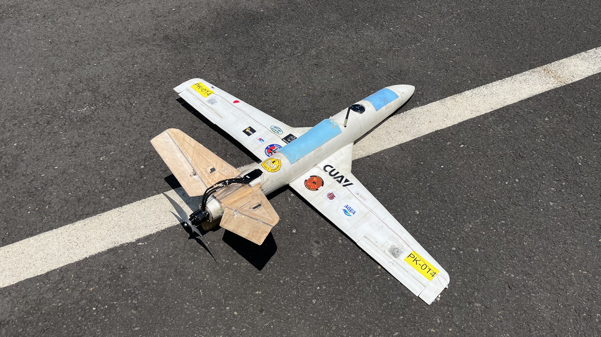
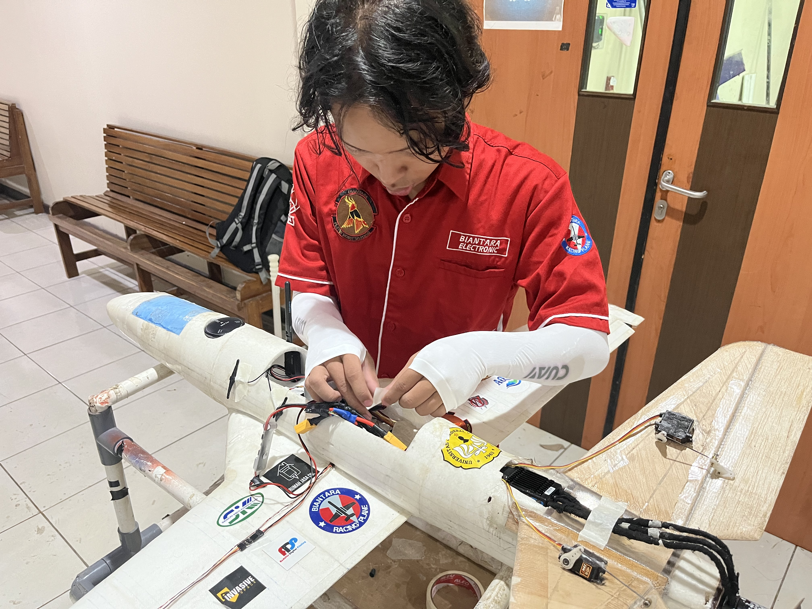
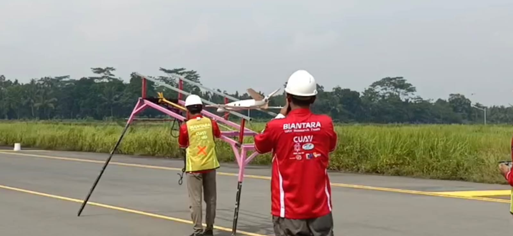

# ✈️ Biantara — UAV Racing Plane (KRTI)

A high-speed fixed-wing UAV racing plane developed by Biantara UAV Research Team for the Indonesian Flying Robot Contest (KRTI) national competition — achieving **Top 8 at KRTI 2024** and **Top 16 at KRTI 2025**.

---

## 🔍 Overview

Biantara is a UAV research and development team from Jenderal Soedirman University that focuses on designing, manufacturing, and optimizing racing aircraft for the annual Indonesian Robot Contest (Kontes Robot Terbang Indonesia/KRTI). The airframe is primarily constructed from hard foam shaped using a hot-wire cutting process and reinforced with fiberglass and epoxy resin to improve structural strength and durability. Carbon fiber strips are embedded within the wings to withstand aerodynamic loads during high-speed maneuvers, while the tail section is built from lightweight balsa wood to reduce overall weight.

The aircraft is equipped with a CUAV X7+ flight controller featuring a high-performance STM32H743 processor with triple-redundant IMU architecture, providing reliable and precise autonomous flight control. Propulsion is driven by a T-Motor brushless motor combined with a Hobbywing electronic speed controller (ESC) and powered by a 6S LiPo battery, delivering the thrust and efficiency required for competitive racing missions. The onboard system operates using ArduPilot firmware, enabling autonomous navigation, waypoint following, and advanced flight management during competition.

As **Head of the Racing Plane Team**, I led a multidisciplinary team of 12 members in the research, design, development, and testing of a fixed-wing UAV for the Indonesian Flying Robot Contest (KRTI) 2024 and 2025.

---

## 🏆 Achievements

| Year | Competition | Result |
|---|---|---|
| 2024 | KRTI — Indonesian Flying Robot Contest, Racing Plane Division | **Top 8 National** |
| 2025 | KRTI — Indonesian Flying Robot Contest, Racing Plane Division | **Top 16 National** |

---

## ⚙️ System Architecture

```
[Airframe — EPO/EPP Foam + Carbon Fiber Reinforcement]
        ↓
[Propulsion — Brushless Motor + ESC]
        ↓
[Avionics System]
    ├── Flight Controller (ArduPilot)
    │       ├── Autonomous Flight Logic
    │       ├── PID Tuning & Stabilization
    │       └── Waypoint Navigation
    ├── CAN Bus Communication
    │       ├── ESC (Electronic Speed Controller)
    │       └── Peripheral Sensors
    ├── GPS Module — Position & Navigation
    ├── IMU — Attitude & Orientation
    ├── Airspeed Sensor — Speed Measurement
    └── RC Receiver — Manual Override
        ↓
[Ground Control Station — Mission Planner]
```

---

## 🛠️ Hardware Components

| Component | Specification / Function |
|---|---|
| Airframe | EPO/EPP foam with carbon fiber reinforcement |
| Flight Controller | CUAV X7+ - ArduPilot |
| Firmware | ArduPilot (ArduPlane) |
| GPS Module | CUAV NEO 3 PRO - Waypoint navigation |
| IMU | Attitude estimation & stabilization |
| Brushless Motor + ESC | T-Motor 3520 880 KV + ESC Hobbywing 120A - Propulsion system |
| RC Receiver | Manual override & failsafe |
| Telemetry Module | Holybro 433 MHz - Real-time data link to ground station |

---

## 💻 Software & Tools

| Tool | Usage |
|---|---|
| ArduPilot (ArduPlane) | Flight controller firmware & autonomous logic |
| Mission Planner | Ground control station, parameter tuning, mission planning |
| SolidWorks & Fusion 360 | Airframe structural design & 3D modeling |

---

## 🔧 Key Technical Contributions

As Head of Avionics Division, my contributions spanned all aspects of the UAV development:

**Airframe Design & Fabrication**
- Designed airframe geometry and structural layout using Fusion 360 and SolidWorks
- Fabricated foam (EPO/EPP) airframe with carbon fiber reinforcement for high-speed racing performance
- Iterated airframe design between KRTI 2024 and KRTI 2025 based on competition feedback

**Avionics & Embedded Systems**
- Integrated full avionics stack: flight controller, GPS, IMU, airspeed sensor, and telemetry module
- Configured CAN Bus communication between flight controller and ESC peripherals
- Designed and organized avionics wiring and electronic layout for weight optimization

**Flight Controller & Autonomous Logic**
- Configured ArduPilot (ArduPlane) firmware for fixed-wing autonomous flight
- Performed PID tuning for roll, pitch, and yaw stabilization at high-speed conditions
- Programmed autonomous waypoint navigation and mission logic using Mission Planner
- Conducted pre-flight testing, data logging, and iterative performance analysis

---

## 📊 Performance

| Parameter | KRTI 2024 | KRTI 2025 |
|---|---|---|
| Max Speed | 198 km/h | 223.2 km/h |
| Competition Result | Top 8 National | Top 16 National |
| Team Size | 12 persons | 12 persons |

---

## 📁 Repository Structure

```
uav-krti/
├── design/
│   └── airframe/             # 3D design files
├── avionics/
│   ├── parameter/            # ArduPilot parameter files (.param)
│   └── wiring-diagram/       # Avionics wiring schematic
├── mission/
│   └── waypoints/            # Mission Planner waypoint files
├── docs/
│   └── images/               # UAV photos, flight videos, competition docs
└── README.md
```

---

## 📸 Documentation

| UAV Overview | Avionics Setup | Competition Flight |
|---|---|---|
|  |  |  |

---

## 👥 Team

**Soedirman Robotic Team — Biantara UAV Division**
Universitas Jenderal Soedirman (Unsoed)

| Role | Responsibility |
|---|---|
| Mechanic Team | Airframe design, Launcher design, Structural fabrication and assembly |
| Electrical and Propulsion Team | Propulsion Configuration, Electrical wiring, Propeller, Motor, ESC, and power system |
| Navigation Team | Autonomous logic, Flight controller, Avionics integration, Mission planning and flight testing |

---

## 👤 Author

**Farhan Ibnufajar** — Head of the Racing Plane Team
Electrical Engineering — Universitas Jenderal Soedirman (Unsoed)

[](https://github.com/farhanibnufajar)
[](https://farhanibnufajar.github.io)

---

## 📄 License

This project is open source and available under the [MIT License](LICENSE).
